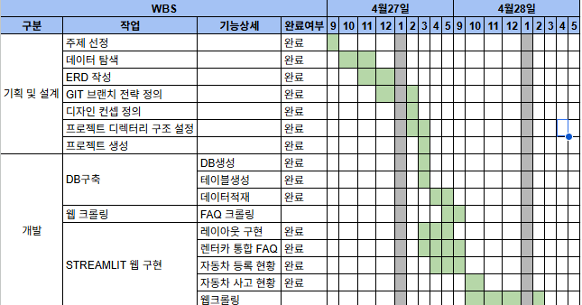

# 1. 팀소개

### 팀명: Simple is Best

<table>
  <tr>
    <td align="center">
      <a href="https://github.com/jhs7067">
        
         
        <b>정형섭</b>
      </a>
       
      PM, Backend
    </td>
    <td align="center">
      <a href="https://github.com/Hyungho-oh">
        
         
        <b>오형호</b>
      </a>
       
      Frontend, 발표
    </td>
    <td align="center">
      <a href="https://github.com/hellene0708-cyber">
        
         
        <b>고현아</b>
      </a>
       
      DB, 자료조사
    </td>
    <td align="center">
      <a href="https://github.com/kimsahee0401271111-collab">
        
         
        <b>김세희</b>
      </a>
       
      DB, 자료조사
    </td>
  </tr>
</table>

 
 

# 2. 프로젝트 개요
### 2.1. 프로젝트 명

렌터카 고객 분석 서비스

### 2.2. 프로젝트 소개

렌터카 업체의 FAQ 데이터를 통합하여 기존 고객의 불편사항과 니즈를 분석하고,  
공공데이터(자동차 등록 현황, 사고 다발 지역)를 활용해 잠재 수요를 도출한 뒤  
Streamlit 기반의 데이터 시각화를 구현한 프로젝트이다.

### 2.3. 프로젝트 필요성(배경)

렌터카 관련 고객 데이터(FAQ)와 공공데이터가 분산되어 개별적으로 활용되고 있어,  
렌터카 수요와 고객 니즈를 종합적으로 파악하기 어렵다.  
이에 따라 데이터를 통합 분석하여 보다 정확한 수요 예측과 고객 이해가 필요하다.

### 2.4. 프로젝트 목표

분산된 고객 데이터와 공공데이터를 통합 분석하여 렌터카 수요와 고객 니즈를 도출하고,  
데이터 기반의 고객 유치 전략 수립을 가능하게 한다.

 
 

# 3. 🔧 기술 스택
 

 
 

# 4. WBS

 
 

# 5. 요구사항 명세서

 
 

# 6. ERD

 
 

# 7. 주요 프로시저

1. **FAQ 데이터 수집**
   - 렌터카 업체별 FAQ 데이터를 수집한다.
   - 수집한 FAQ를 통합하여 고객 문의 데이터를 구성한다.

2. **공공데이터 수집**
   - 자동차 등록 현황, 사고 다발지역 데이터를 수집한다.
   - 지역별 렌터카 수요 분석에 활용할 데이터를 정리한다.

3. **데이터 저장 및 전처리**
   - 수집한 데이터를 MySQL에 저장한다.
   - 분석에 필요한 컬럼을 정리하고 결측값, 중복값 등을 처리한다.

4. **데이터 분석**
   - FAQ 기반으로 기존 고객의 문의 유형과 불편사항을 분석한다.
   - 공공데이터 기반으로 잠재 렌터카 수요가 높은 지역을 분석한다.

5. **시각화 구현**
   - Streamlit을 활용하여 분석 결과를 대시보드 형태로 구현한다.
   - FAQ 분석 결과, 자동차 등록 현황, 사고 현황 등을 화면에서 확인할 수 있도록 구성한다.
 
 

# 8. 수행결과(테스트/시연 페이지)

### 📌 렌터카 통합 FAQ

---

### 📌 자동차 등록 현황

---

### 📌 자동차 사고 현황

---

### 📌 웹크롤링

 
 

# 9. 한 줄 회고
### 🙆🏻‍♂️ 정형섭
프로젝트에서 PM 및 백엔드 모듈 개발을 맡아 전체 일정 관리와 기술 구현을 동시에 수행했습니다. PM 역할에서는 팀원 간 작업 범위를 조율하고 개발 일정을 관리하며 프로젝트가 계획대로 진행될 수 있도록 지속적으로 커뮤니케이션을 진행했습니다. 특히 요구사항 정의와 작업 우선순위 설정 과정에서 프로젝트 방향성을 명확히 하는 데 집중했습니다.

백엔드 개발 측면에서는 모듈 단위로 구조를 설계함으로써 유지보수성과 확장성을 확보하고자 했습니다. 이번 프로젝트를 통해 단순 구현을 넘어서, 일정 관리와 기술 설계를 함께 고려하는 PM의 역할과 백엔드 개발자의 책임을 동시에 수행하는 경험을 할 수 있었으며, 전체 시스템을 바라보는 시야를 넓힐 수 있었습니다.

### 🙆🏻‍♂️ 오형호
프로젝트에서 공공데이터를 활용하여, 통계적인 수치화면을 만들고 시현가능하도록 하는 역할을 맡았습니다. 
우선 주제에 맞는 데이터를 찾는과정에서 어떤식으로 유효하고 가치있는 데이터를 활용할것인가가 가장 고민이였습니다.
Streamlit의 기능을 활용하는데 표현방법을 바꿔가며 효과적으로 보여줄수 있을지, 데이터를 가공하는 단계에서 가장 어려웠지만 숫자들을 활용해서 보여주는 작업들을 통해 구조와 시현을 하는 방법을 배울수 있었습니다.

### 🙆🏻 고현아
어렵게 수집한 데이터를 SQL로 정리하는 과정도 쉽지 않았는데, 테이블 구조 설계부터 데이터 삽입 쿼리 작성까지 이론으로 배운 것과 실제로 적용하는 것 사이에 생각보다 큰 차이가 있었습니다. 하지만 오류를 하나씩 해결해 나가며 쿼리를 다듬고, 데이터가 DB에 깔끔하게 쌓이는 것을 확인했을 때 비로소 전체 흐름이 자연스럽게 이해되기 시작했습니다. 이 경험을 통해 데이터를 단순히 가져오는 것을 넘어, SQL로 구조화하고 활용 가능한 형태로 만드는 것이 데이터 작업에서 얼마나 중요한지 직접 느껴볼 수 있었습니다.

### 🙆🏻 김세희
단순히 데이터를 수집하는 것과 실제 서비스 구조를 설계하는 것은 큰 차이가 있다는 점을 체감했습니다.
처음에는 문법과 구현에만 집중했지만, 프로젝트를 진행할수록 데이터 간의 관계와 흐름을 설계하는 과정이 훨씬 중요함을 알게 되었습니다.
특히 여러 테이블을 연결하며 다대다 관계와 ERD를 직접 설계해 본 경험은 데이터베이스 구조를 이해하는 데 큰 도움이 되었습니다.
그 과정에서 키 중복이나 타입 불일치 등 다양한 오류를 해결하며, 탄탄한 기초 설계의 중요성을 실감고, 추가로 Python과 MySQL을 연동하며 겪은 시행착오들 역시 프로그램과 DB가 소통하는 실무적인 흐름을 익히는 데 큰 도움이 되었습니다.
이번 프로젝트를 통해 기능 구현뿐아니라, 데이터의 흐름과 구조를 보는 눈을 기를 수 있어 유익한 시간이었습니다.

 
