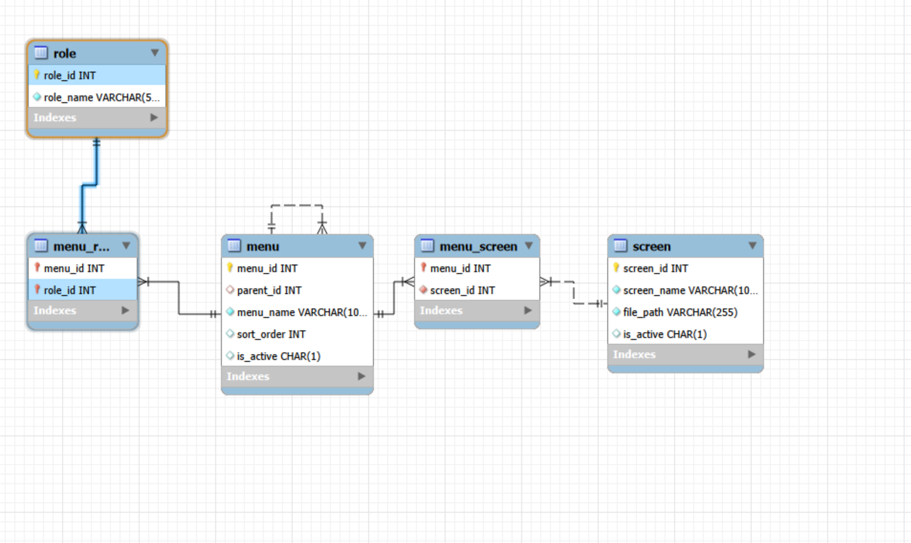
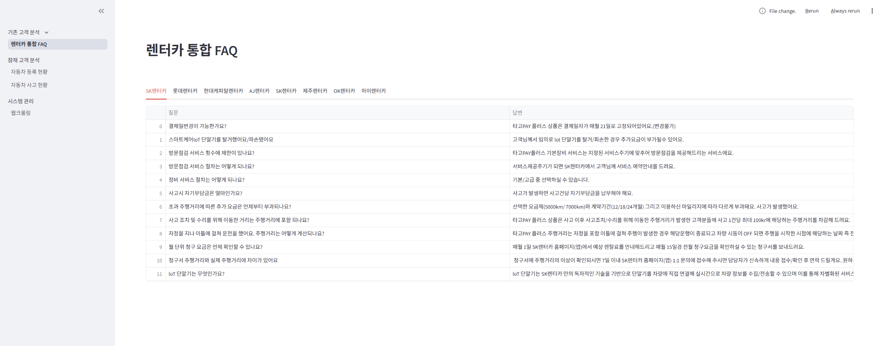
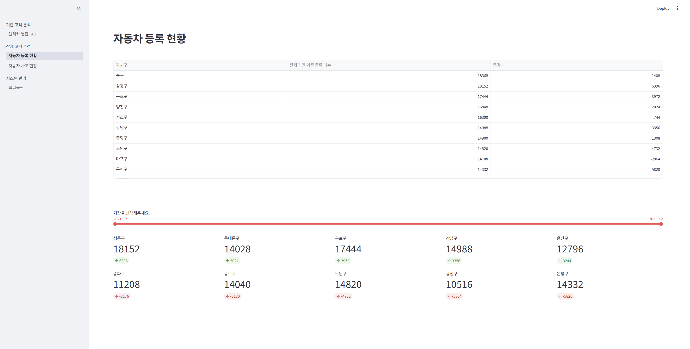
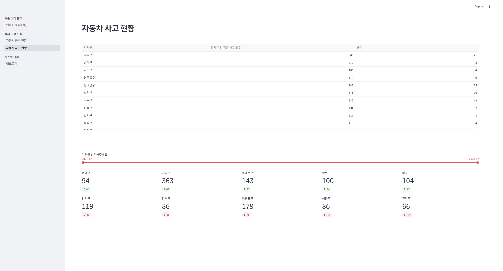
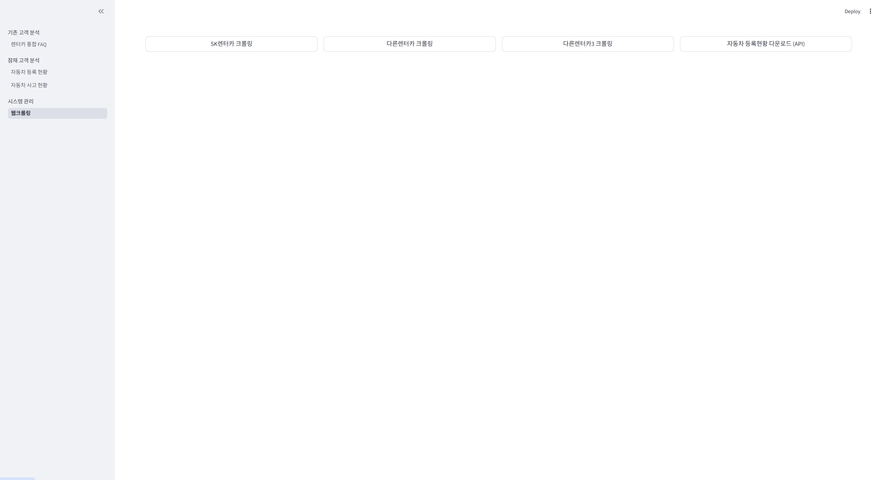

# 렌트카 고객분석 서비스

- 📅 **기간**: 2026.03.27 ~ 2026.03.31
- 🧑‍🧑‍🧒 **팀원**: 정형섭, 오형호, 고현아, 김세희

<table>
  <tr>
    <td align="center">
      <a href="https://github.com/jhs7067">
        
        <br />
        <sub><b>정형섭</b></sub>
      </a>
      <br />
      PM, Backend
    </td>
    <td align="center">
      <a href="https://github.com/Hyungho-oh">
        
        <br />
        <sub><b>오형호</b></sub>
      </a>
      <br />
      Frontend
    </td>
    <td align="center">
      <a href="https://github.com/hellene0708-cyber">
        
        <br />
        <sub><b>고현아</b></sub>
      </a>
      <br />
      DB
    </td>
    <td align="center">
      <a href="https://github.com/kimsahee0401271111-collab">
        
        <br />
        <sub><b>김세희</b></sub>
      </a>
      <br />
      DB
    </td>
  </tr>
</table>

<br/>

---
## 🗂️ 프로젝트 개요
- 렌터카 업체 FAQ를 통합하여 기존 고객의 불편사항과 니즈를 분석하고, 공공데이터(자동차 등록현황, 사고 다발지역)를 활용해 잠재 수요를 도출한 뒤 Streamlit 기반 시각화 대시보드를 구현한 프로젝트입니다.

<br>

---
## 💡 프로젝트 목표

- FAQ 통합을 통한 기존 고객 문의 유형 및 니즈 파악 기반 마련
- 공공데이터 기반 렌터카 수요 지역 분석 및 잠재 고객 도출
- 데이터 수집·정제 및 시각화 구현

<br>

---
## 📌 문제 정의
> **"렌터카는 사고 다발지역과, 아직 구매력이 약한 젊은 20~30대가 많이 이용하지 않을까?"**

본 프로젝트에서는 사고 발생건수와 지역별 자동차 등록자료를 기반으로 잠재적 렌터카 수요가 높은 지역을 분석하고 예측한다.  
아울러 렌터카 업체 FAQ를 통합하여 기존 고객의 문의 유형과 불편사항을 파악하고, 서비스 개선 및 고객 니즈 도출을 위한 기반을 마련한다.

<br>

---
## 💡 시스템 목표
> **"수집데이터의 활용 "**

렌터카는 사고 다발지역 과 자동차 등록댓수가 많은 지역을 확인하여, 구매가능성이 높은 지역을 선정해, 적극적인 고객유치 전략을 짠다.

<br>

---
## 🔧 기술 스택
 
| 구분 | 기술 |
|---|---|
| 언어 | Python |
| 시각화 | Streamlit |
| 데이터베이스 | MySQL |

<br>

---
<!-- 추후 작성 -->
<!-- ## 🏷️ 활용 데이터
| 데이터 | 출처 | 활용 목적 |
|---|---|---|
| 자동차 신규등록정보 | 공공데이터 포털 (한국교통안전공단) | 등록자의 성별 · 나이 · 차종 · 날짜를 수집하여 차트와 표로 표시 |
| 정책 보도자료 | 기후에너지환경부 (mcee.go.kr) | 보도자료 내용을 수집하여 워드클라우드 이미지 생성에 사용 |
| 월별 전기차 등록대수 | 한국스마트그리드협회 charge info | 전기차 등록대수와 뉴스 수의 관계 분석에 사용 |
| 전기차 정책 뉴스 | 네이버 뉴스 | 월별 전기차 보조금 뉴스 수를 수집하여 관계 분석에 사용 |
| FAQ | 기아 · 한국전력 kepco · 현대자동차 · 테슬라 공식 블로그 | FAQ 내용을 수집하여 통합 FAQ 표시에 사용 | -->

<br>

---
## 📋 ERD 다이어그램
<!--  -->


<br>

```

project/
│
├── src/
│   ├── modules/
│   │   ├── crawling_module.py
│   │   ├── db_connect_module.py
│   │   └── streamlit_module.py
│   │
│   ├── resources/
│   │   ├── csv/
│   │   │   ├── 교통사고.csv
│   │   │   ├── 롯데렌터카_faq.csv
│   │   │   ├── 자동차등록수.csv
│   │   │   ├── 현대캐피탈렌터카_faq.csv
│   │   │   ├── sample.csv
│   │   │   └── SK렌터카_faq.csv
│   │   ├── img/
│   │   │   ├── db_connection_info.png
│   │   │   ├── erd_info.png
│   │   │   ├── profile1.png
│   │   │   ├── profile2.png
│   │   │   ├── profile3.png
│   │   │   ├── profile4.png
│   │   │   ├── erd_info.png
│   │   │   └── streamlit_run_info.png
│   │   ├── sql/
│   │   │   └── ddldml.sql
│   │   │   
│   └── views/
│       ├── analysis/
│       │   ├── new_cust/
│       │   │   ├── car_acc.py
│       │   │   └── car_reg.py 
│       │   │
│       │   └── old_cust/
│       │       └── rental_car_faq.py
│       │   
│       └── sys_mg/
│           └── crawling_mg.py
│
├── app.py               # 실행모듈
├── guide.md             # 개발자 가이드 md
└── README.md            # 프로젝트 소개


```

---
## 🖥️ 프로젝트 시연
- **렌터카 통합 FAQ**
  

<br>

- **자동차 등록 현황**
  

<br>

- **자동차 사고 현황**
  

<br>

- **웹크롤링**
  
  
<br>

---
## 회고
### 🙆🏻‍♂️ 정형섭
프로젝트에서 PM 및 백엔드 모듈 개발을 맡아 전체 일정 관리와 기술 구현을 동시에 수행했습니다. PM 역할에서는 팀원 간 작업 범위를 조율하고 개발 일정을 관리하며 프로젝트가 계획대로 진행될 수 있도록 지속적으로 커뮤니케이션을 진행했습니다. 특히 요구사항 정의와 작업 우선순위 설정 과정에서 프로젝트 방향성을 명확히 하는 데 집중했습니다.

백엔드 개발 측면에서는 모듈 단위로 구조를 설계함으로써 유지보수성과 확장성을 확보하고자 했습니다. 이번 프로젝트를 통해 단순 구현을 넘어서, 일정 관리와 기술 설계를 함께 고려하는 PM의 역할과 백엔드 개발자의 책임을 동시에 수행하는 경험을 할 수 있었으며, 전체 시스템을 바라보는 시야를 넓힐 수 있었습니다.

### 🙆🏻‍♂️ 오형호
프로젝트에서 공공데이터를 활용하여, 통계적인 수치화면을 만들고 시현가능하도록 하는 역할을 맡았습니다. 
우선 주제에 맞는 데이터를 찾는과정에서 어떤식으로 유효하고 가치있는 데이터를 활용할것인가가 가장 고민이였습니다.
Streamlit의 기능을 활용하는데 표현방법을 바꿔가며 효과적으로 보여줄수 있을지, 데이터를 가공하는 단계에서 가장 어려웠지만 숫자들을 활용해서 보여주는 작업들을 통해 구조와 시현을 하는 방법을 배울수 있었습니다.

### 🙆🏻 고현아
어렵게 수집한 데이터를 SQL로 정리하는 과정도 쉽지 않았는데, 테이블 구조 설계부터 데이터 삽입 쿼리 작성까지 이론으로 배운 것과 실제로 적용하는 것 사이에 생각보다 큰 차이가 있었습니다. 하지만 오류를 하나씩 해결해 나가며 쿼리를 다듬고, 데이터가 DB에 깔끔하게 쌓이는 것을 확인했을 때 비로소 전체 흐름이 자연스럽게 이해되기 시작했습니다. 이 경험을 통해 데이터를 단순히 가져오는 것을 넘어, SQL로 구조화하고 활용 가능한 형태로 만드는 것이 데이터 작업에서 얼마나 중요한지 직접 느껴볼 수 있었습니다.

### 🙆🏻 김세희
단순히 데이터를 수집하는 것과 실제 서비스 구조를 설계하는 것은 큰 차이가 있다는 점을 체감했습니다.
처음에는 문법과 구현에만 집중했지만, 프로젝트를 진행할수록 데이터 간의 관계와 흐름을 설계하는 과정이 훨씬 중요함을 알게 되었습니다.
특히 여러 테이블을 연결하며 다대다 관계와 ERD를 직접 설계해 본 경험은 데이터베이스 구조를 이해하는 데 큰 도움이 되었습니다.
그 과정에서 키 중복이나 타입 불일치 등 다양한 오류를 해결하며, 탄탄한 기초 설계의 중요성을 실감고, 추가로 Python과 MySQL을 연동하며 겪은 시행착오들 역시 프로그램과 DB가 소통하는 실무적인 흐름을 익히는 데 큰 도움이 되었습니다.
이번 프로젝트를 통해 기능 구현뿐아니라, 데이터의 흐름과 구조를 보는 눈을 기를 수 있어 유익한 시간이었습니다.

<br>
