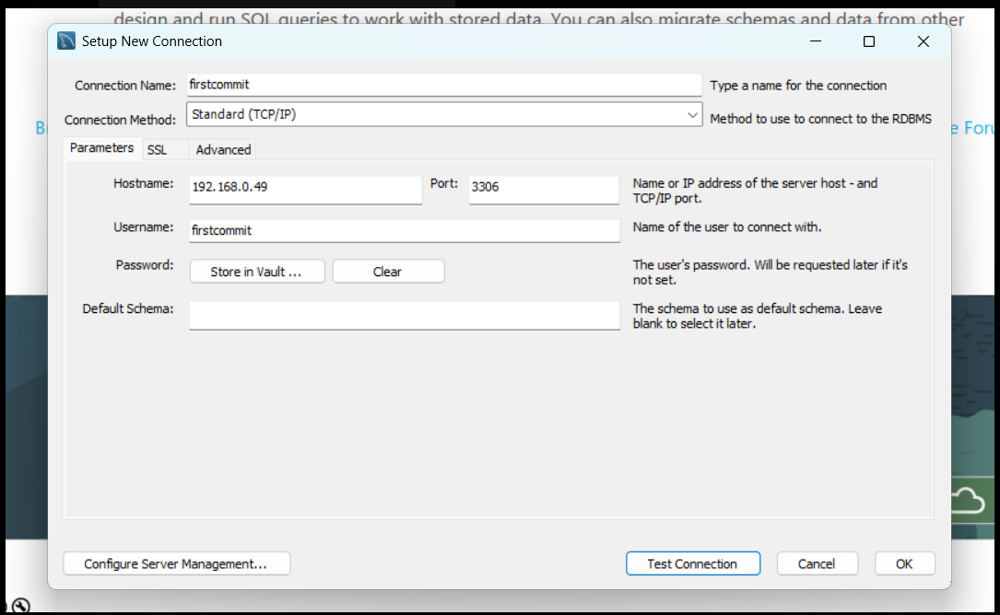
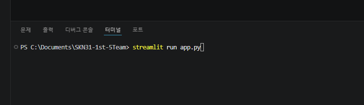

# 가이드

## pip install

- pip install streamlit lxml
- pip install pymysql
- pip install pandas
- pip install requests
- pip install BeautifulSoup4
- pip install selenium
- pip install webdriver-manager

## DB connection

- 

## 실행 명령어

- streamlit run app.py

- 
